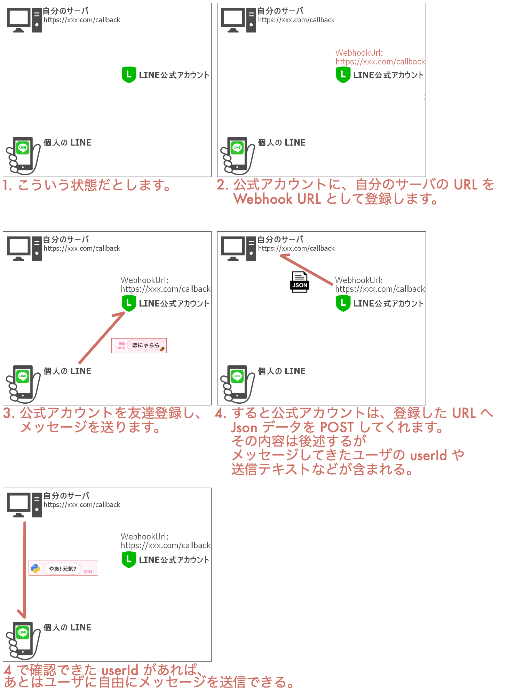

line-messaging-api-py
===

The repository that consists of code related to LINE Messaging API.

## 自分のサーバと LINE 公式アカウントと個人の LINE の関係を示した図

## このリポジトリを動かすまでの手順

LINE 公式アカウントを作る。

- LINE Developers へ行く↓
    - https://developers.line.biz/
- ビジネスアカウントでログインする
    - 別に個人の LINE アカウントでもいいんだけど、実際に使いそうなのはこっちじゃね?
- プロバイダを作る (アプリを提供する組織のこと)
- チャネル (LINE に表示させたい名前をつければいい)
    - Create a Messaging API channel
- Basic settings > Channel secret からシークレットを取得
    - LINE_CHANNEL_SECRET: ...
- Messaging API > Channel access token からトークンを取得
    - LINE_CHANNEL_ACCESS_TOKEN: ...

本リポジトリの flask アプリをデプロイする。

- 以前は Heroku へアップしてたけれど、 Heroku 改悪により廃止。
- いまは App Service へアップしている。
    - App Service のときは App Service logs > ON にしとくこと。

かんたんに動作確認したら、 Webhook URL を設定する。

- Messaging API > Webhook settings

## line-bot-sdk v3 対応済み

:)
